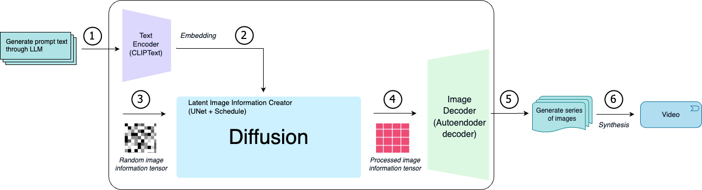

  


Explore the Application of Diffusion Model in Video Content Creation
---

This is a repository for documenting our CS577 group project. It contains all code, reports, demonstration materials, etc. during the project experiment.

Project Description
---
In the era of collision between short videos and AIGC, can Stable Diffusion generate video like image? With the help of the Stable Diffusion model, we designed the following pipeline, and then conducted a large number of experiments around this pipeline. For details, please refer to the code and reports in above repository.



Directory Structure
---
    .
    ├── 01_Study the Diffusion Model Step By Step.ipynb
    ├── 02_Apply the Diffusion Model to Generate Images and Music.ipynb
    ├── 03_Application_in_Video_Content_Creation
    ├── 04_Project_Experiments
    │   ├── 04_The_Experiment_of_CS577_Project.ipynb
    │   ├── music_source  # Music sorce for generating video
    │   │   ├── flower-146718.mp3
    │   │   ├── stylish-rock-beat-trailer-116346.mp3
    │   │   └── time-technology-11257.mp3
    │   └── pipeline.png
    ├── 05_Project_Reports
    │   ├── CS577_Final_Project_Report.pdf
    │   ├── CS577_Intermediate_Project_Report.pdf
    │   └── CS577_Project_proposal.pdf
    ├── 06_Final_Project_Presentation
    │   ├── CS577_Final_Project_Presentation.pdf
    │   └── Explore the Application of xxx.pptx

Cooperation and division of labor
---

- [Haiyun Xiao / A20497920](https://github.com/byxhy)
  - Explore the applications of stable diffusion experiments
    - 04_The_Experiment_of_CS577_Project.ipynb
  - Write reports for different stages of the project
    - CS577_Project_proposal.pdf
    - CS577_Intermediate_Project_Report.pdf
    - CS577_Final_Project_Report.pdf
  - Prepare presentation slides and record presentation video
    - CS577_Final_Project_Presentation.pdf
    - CS577_Final_Project_Presentation.mov
  - Organized 3 online meetings for project phase discussions
  - Create and maintain this github repository

- [Yu Li](https://github.com/liyu98)
  - Explore the applications of stable diffusion experiments
    - 01_Study the Diffusion Model Step By Step.ipynb
    - 02_Apply the Diffusion Model to Generate Images and Music.ipynb
    - 03_Application_in_Video_Content_Creation  
  - Participate in writing reports
    - CS577_Project_proposal.pdf
    - CS577_Intermediate_Project_Report.pdf
    - CS577_Final_Project_Report.pdf
  - Prepare presentation slides （ Model Principles and Training ）
    - Explore the Application of Diffusion Model in Video Content Creation.pptx


- [Haichen Pang](https://github.com/panghc2020)


Comments
---

- The jupyter notebook of the experimental part can be run directly in `colab`. Other parts of the code need to install the necessary libraries before testing. You can find it in the notes in the notebook.

- All references and source code can be found in jupyter notebooks.

- If you want to know some details about this project, you can check the report `04_Project_Experiments/CS577_Final_Project_Report.pdf`.


BibTeX

```
@misc{haiyupang2023diffusion, 
  title={Explore the Application of Diffusion Model in Video Content Creation},
  author={Haiyun Xiao, Yu Li and Haichen Pang},
  year={2023},
  url={https://github.com/byxhy/Explore-Stable-Diffusion/}
}
```


